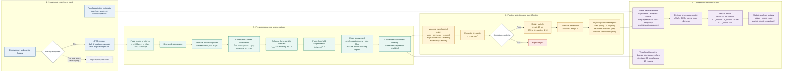

# Automated droplet/capsule image analysis

```mermaid
flowchart LR
    subgraph INPUT["1 · Image and experiment input"]
        direction TB
        A["JPEG images<br/>dark droplets or capsules<br/>on a bright background"]
        A1["Discover run and combo folders"]
        A2{"Already analyzed?"}
        A3["Read acquisition metadata<br/><i>step.json, scale.csv,<br/>oscilloscope.csv</i>"]
        A1 --> A2
        A2 -- "No" --> A
        A2 -. "Yes: skip unless<br/>reanalyzing" .-> SKIP["Registry entry retained"]
    end

    subgraph SEG["2 · Pre-processing and segmentation"]
        direction TB
        B1["Fixed region of interest<br/>x = 690 px, y = 10 px<br/>1660 × 3900 px"]
        B2["Grayscale conversion"]
        B3["Estimate local background<br/>Gaussian blur, σ = 80 px"]
        B4["Correct non-uniform illumination<br/><i>I</i><sub>corr</sub> = <i>I</i><sub>background</sub> − <i>I</i><sub>gray</sub><br/>normalize to 0–255"]
        B5["Enhance faint-particle contrast<br/><i>I</i><sub>corr</sub> &gt; 5: multiply by 2.5"]
        B6["Fixed-threshold segmentation<br/><i>I</i><sub>enhanced</sub> &gt; 2"]
        B7["Clean binary mask<br/>small-object removal · hole filling<br/>exclude border-touching regions"]
        B8["Connected-component labeling<br/>watershed separation disabled"]

        B1 --> B2 --> B3 --> B4 --> B5 --> B6 --> B7 --> B8
    end

    subgraph QUANT["3 · Particle selection and quantification"]
        direction TB
        C1["Measure each labeled region<br/>area · perimeter · centroid<br/>major/minor axes · intensity<br/>eccentricity · solidity"]
        C2["Compute circularity<br/><i>C</i> = 4π<i>A</i>/<i>P</i><sup>2</sup>"]
        C3{"Acceptance criteria"}
        C4["Retain particle<br/>area ≥ 20 px²<br/>0.50 ≤ circularity ≤ 1.10"]
        C5["Reject object"]
        C6["Calibrate dimensions<br/>0.01742 mm px⁻¹"]
        C7["Physical particle descriptors<br/>area (mm²) · ECD (mm)<br/>perimeter and axes (mm)<br/>centroid coordinates (mm)"]

        C1 --> C2 --> C3
        C3 -- "Pass" --> C4 --> C6 --> C7
        C3 -- "Fail" --> C5
    end

    subgraph DATA["4 · Contextualization and output"]
        direction TB
        D1["Enrich particle records<br/>experiment · material · nozzle<br/>pump speed/mass flow · frequency<br/>oscillation displacement"]
        D2["Derived process descriptor<br/><i>d</i><sub>d</sub>/<i>d</i><sub>i</sub> = ECD / nozzle inner diameter"]
        D3["Tabular results<br/>one CSV per combo<br/>ALL_PARTICLE_RESULTS.csv<br/>ALL_RUNS.csv"]
        D4["Visual quality control<br/>labeled boundary overlays<br/>six-stage QC panel every 10 images"]
        D5["Update analysis registry<br/>status · image count<br/>particle count · output path"]

        D1 --> D2 --> D3 --> D5
    end

    A --> B1
    A3 --> D1
    B8 --> C1
    B8 --> D4
    C7 --> D1

    classDef input fill:#E8F1FA,stroke:#286090,color:#102A43,stroke-width:1.5px;
    classDef process fill:#E9F7F3,stroke:#23856D,color:#123B32,stroke-width:1.5px;
    classDef quantify fill:#FFF4D6,stroke:#B7791F,color:#513C06,stroke-width:1.5px;
    classDef output fill:#F2EAF8,stroke:#7551A1,color:#332044,stroke-width:1.5px;
    classDef decision fill:#FFFFFF,stroke:#59636E,color:#1F2933,stroke-width:1.5px;
    classDef reject fill:#FCE8E6,stroke:#C0392B,color:#641E16,stroke-width:1.2px;
    classDef muted fill:#F3F4F6,stroke:#9CA3AF,color:#4B5563,stroke-dasharray:4 3;

    class A,A1,A3 input;
    class B1,B2,B3,B4,B5,B6,B7,B8 process;
    class C1,C2,C4,C6,C7 quantify;
    class D1,D2,D3,D4,D5 output;
    class A2,C3 decision;
    class C5 reject;
    class SKIP muted;
```

*ECD: equivalent circular diameter; QC: quality control.*
